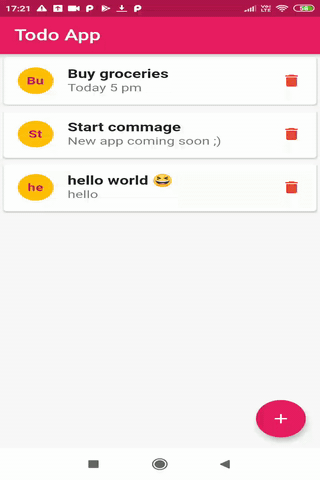

## Flutter Todo app

* A TODO  app based on flutter framework.
* Database used is sqflite -SQLite plugin for Flutter which acts as a local database.

## To run the app
* Clone / download OR Copy the lib folder and pubspec.yaml to any base flutter project.
- Run the app with :

      flutter run

## Features

* Add a To-do containing title ,description.
* Edit , Update ,Delete the Todo.
* Share the Todo with any app that shares text.

## Demo 

## Getting Started

This project is a starting point for a Flutter application.

A few resources to get you started if this is your first Flutter project:

- [Lab: Write your first Flutter app](https://flutter.dev/docs/get-started/codelab)
- [Cookbook: Useful Flutter samples](https://flutter.dev/docs/cookbook)

For help getting started with Flutter, view our
[online documentation](https://flutter.dev/docs), which offers tutorials,
samples, guidance on mobile development, and a full API reference.
